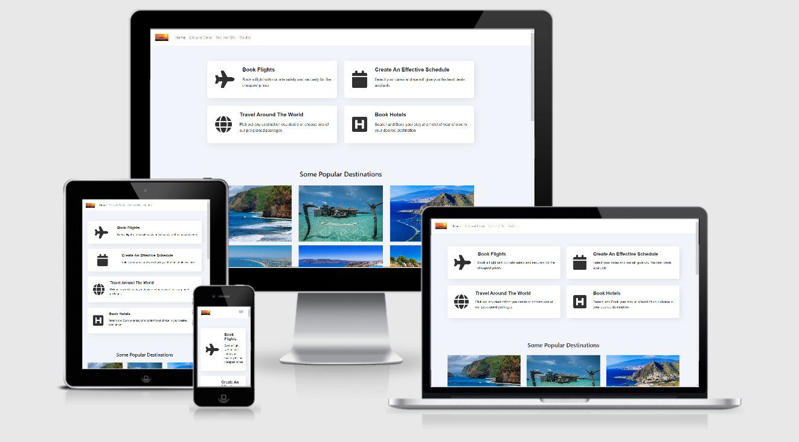

# Tourist website

This site will be an ongoing page, designed to presenting the user the oportunit to book and plan his vacation to his desired destination

It`s creation is for my second milestone project as a Full Stack software developer student of the Code Institute (https://codeinstitute.net/),
with the goal of showcaseing some popular tourist destinations as well as the oportunity to book theb est hotels possible or just pick a
prepalned option out of the selection available.

## UX

The purpose of the site is to allow a lot of freedom for people in choosing travel destinations and an ease of booking for everything

#### User Stories

- As a user I would like help to plan my vacation

- As a person who has not fully decided his travel desstination, I would like an opotunity to see and possibly choose different vacation plan options.

- As a buyer, I would like a variety of hotels and lfights to choose from that suit my budget.

## Features

### Existing Features

- **Home page** - The home page contains most of the current features. There are 3 main sections - the first one shows future plans that I have for this website as in booking lfights or creating your own schedule, second one
  is a popular picture of a famous tourist site in hopes it helps the user choose his next ravel destination properly and third part is the map
  with the function to pick yuor desired country and book a respective hotel there.

### Features Left to Implement

- **Eat and Drink** - Creating a page to showcase most popular restaurants in the area you are located in or an area of your choosing.

- **Home page** - Expand the hotel booking function and adding an option to book flights as well.

- **See and Do** - A page that shows all the most popular tourist destinations in your local area or in an area of your choosing.

- **Guides** - Adding a page where you can prepick an already created plan for your vacation including bookings and transportation.

## Technologies Used

1.  **HTML:** Used to construct all the pages of this web site. For more information on the language;  
    https://developer.mozilla.org/en-US/docs/Web/HTML

2.  **CSS:** Is used to style various elements on a web page via coloring, fonts, spacing, etc. For further info, see this link;
    https://www.w3.org/Style/CSS/Overview.en.html

3.  **JavaScript:** Is the world's most popular programming language and the programming language of the Web. For more infomation, see this link:
    https://en.wikipedia.org/wiki/JavaScript

4.  **Bootstrap:** A CSS framework that assists the programmer in creating responsive, mobile first front-end web sites. https://getbootstrap.com/

5.  **Gitpod:** An online IDE also used for creating & saving code that runs in a browser, it does not have to be installed on your PC.
    https://www.gitpod.io/

6.  **Git:** A version control system for tracking changes in source code during software development. https://git-scm.com/

7.  **GitHub:** A company that provides hosting for software development version control using Git. It is a subsidiary of Microsoft. https://github.

8.  **W3C Markup Validation Service** Used to run all html and css code thru a validation process looking for errors; https://validator.w3.org/
    https://jigsaw.w3.org/css-validator/validator

## Testing

1.  http://ami.responsivedesign.is/ has been used to see how the site performs on different devices and their viewports, all pages, links, icons performed as expected on all devices. I also used it to create the AmIResponsive.PNG at the top of this Readme.

2.  **Desktop**

    - Opera Web Browser, Internet Explorer 11 & Google Chrome browsers; all pages, links on those pages, and footer icon links perform well on all viewport sizes.

3.  **Mobile**

    - Used my Huawei P20 lite, as well as roommate's Huawei P30 PRO and my landlord`s Samsung Galaxy S10 smartphone to ; all pages, links, icons performed well on all devices using various browsers; Mozilla & Chrome.

4.  **Open Issues:** Only current issue that I have encountered during testing is that, altho the videos in the Home page are responsive they can get a bit too small on certain devices as seen in the pictures bellow.

## Deployment

1. Created a Github account at https://github.com
   My account url; https://github.com/NihtianAtanasov

2. I uploaded all files to my Github repository located at this url; https://github.com/NihtianAtanasov/Second-Project which is for this individual project.

3. To publish the project to see it on the web, I then went into the Settings on my respository, scrolled down to the heading, GitHub Pages. Under the Source setting, I used the drop-down menu to select master branch as a publishing source and saved it. Refreshed the github page, and you are then given a url where your page is published;
   Your site is published at https://nihtianatanasov.github.io/First-Project/

4. To run this code on your local machine, you would go to my respository at
   https://github.com/NihtianAtanasov/First-Project and on the home page on the right hand side just above all the files, you will see a green button that says,
   "Clone or download", this button will give you options to clone with HTTPS, open in desktop or download as a zip file.
   To continue with cloning, you would;

- Open Git Bash
- Change the current working directory to the location where you want the cloned directory to be made.
- Type git clone, and then paste this URL; https://github.com/NihtianAtanasov/First-Project Press Enter. Your local clone will be created.

For more information about the above process; https://help.github.com/en/github/creating-cloning-and-archiving-repositories/cloning-a-repository

## Credits

### Content

1.  HTML & CSS code directly from: Bootstrap 4.1.1 Snippet by dkstudio; https://bootsnipp.com/snippets/aMp3k.
    Used on my Home page.

2.  HTML & CSS code partly from:
    "Hover Effect Style"
    Bootstrap 4.1.1 Snippet by https://bootsnipp.com/snippets/92e5X.
    Part of both CSS and HTML are used in creating and styling Home page.

3.  JS, HTML and CSS code directly from: Google Map Developers; https://developers.google.com/maps/documentation/javascript/examples/places-autocomplete-hotelsearch

4.  HTML & CSS code directly from:
    "A simple footer design"
    Bootstrap 4.1.1 Snippet by knightrider7660: https://bootsnipp.com/snippets/lGEO2.
    Used on my footer in Home page.

### Media

1.  Am I Responsive web site for checking responsiveness on all Apple devices screen sizes;
    http://ami.responsivedesign.is/

2.  https://stackoverflow.com/ Used as a resource for finding answers to all types of coding problems.

3.  Font Awesome for the icons in my footer; https://fontawesome.com/

4. Google maps for the map function: https://cloud.google.com/maps-platform/

### Acknowledgements

1. Code Institute's Slack Channels and the many alunni,mentors, tutors and users who contribute to them; the many pinned announcements, pdf files, etc. were of great help.
   https://app.slack.com/client/T0L30B202/C0L316Z96

2. Mentor Adegbenga Adeye for site architecture inspiration, programming help, major revelations on website flaws great advice.
   https://www.linkedin.com/in/adegbenga-adeye-psm-i-14003635/?originalSubdomain=ng
